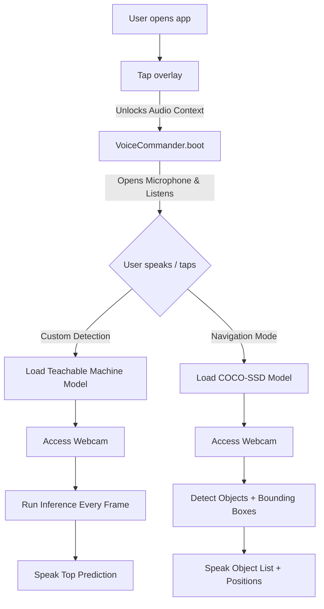

<div align="center">


# 👁️ VisionAlly — Your Smart Everyday Assistant

**AI-powered real-time object detection and navigation assistant built for accessibility.**  
Helping you find objects, understand your surroundings, and navigate with ease — powered by TensorFlow.js, voice commands, and a custom-trained ML model.

<br/>

[](https://developer.mozilla.org/en-US/docs/Web/HTML)
[](https://developer.mozilla.org/en-US/docs/Web/CSS)
[](https://developer.mozilla.org/en-US/docs/Web/JavaScript)
[](https://nodejs.org/)
[](https://expressjs.com/)
[](https://www.tensorflow.org/js)

</div>

---

## 📖 Table of Contents

- [About the Project](#-about-the-project)
- [Key Features](#-key-features)
- [Custom ML Model](#-custom-ml-model)
- [Project Structure](#-project-structure)
- [Tech Stack](#-tech-stack)
- [Getting Started](#-getting-started)
- [Voice Commands Reference](#-voice-commands-reference)
- [API Endpoints](#-api-endpoints)
- [How It Works](#-how-it-works)
- [Screenshots / Demo](#-screenshots--demo)
- [Future Improvements](#-future-improvements)
- [License](#-license)

---

## 🌟 About the Project

**VisionAlly** is an accessibility-first web application that uses real-time AI object detection to help users identify objects, navigate their environment, and trigger emergency assistance — all through voice commands and audio feedback.

Originally built as a final project, VisionAlly combines a custom-trained Teachable Machine image classification model with the general-purpose COCO-SSD detector, wrapped in a polished, responsive web interface with always-on voice recognition.

> 💡 Built with inclusivity in mind — designed for visually impaired users or anyone who needs a hands-free, audio-guided smart assistant.

---

## ✨ Key Features

### 🔍 Dual Detection Modes
| Mode | Description |
|------|-------------|
| **Custom Model Detection** | Uses a Teachable Machine model trained on 11 everyday objects |
| **Navigation Mode** | Leverages the COCO-SSD model for real-time scene understanding and spatial awareness |

### 🎙️ Always-On Voice Commander
- Continuous hands-free voice recognition using the Web Speech API
- Persistent microphone that auto-restarts after silence or errors
- Debounced command processing to prevent duplicate triggers
- Supports natural language phrases (e.g. *"start navigation"*, *"help me"*)

### 🔊 Text-to-Speech Audio Feedback
- Speaks out detected objects, distances, and navigation guidance
- Fully audio-first UX — no screen required

### 🚨 Emergency Contact System
- Save emergency contacts via the UI or voice command
- Contacts persisted server-side in a JSON store
- One-tap / one-voice emergency alert trigger

### 📱 Responsive Design
- Works across desktop and mobile browsers
- Animated hero section with gradient blobs
- Accessible hamburger menu and settings panel

---

## 🧠 Custom ML Model

VisionAlly includes a custom image classification model trained with [Google Teachable Machine](https://teachablemachine.withgoogle.com/).

**Detectable Object Classes:**

| # | Label | # | Label |
|---|-------|---|-------|
| 1 | 🔌 Charger | 7 | ⌚ Watch |
| 2 | 🪑 Chair | 8 | 📗 Book |
| 3 | 🍼 Bottle | 9 | 👓 Specs (Glasses) |
| 4 | 📄 Page | 10 | 🎧 Earphones |
| 5 | 🖊️ Pen | 11 | 💻 Laptop |
| 6 | 📱 Cell Phone | | |

**Model Details:**
- Framework: `@teachablemachine/image` v2.4.12
- TensorFlow.js: v1.7.4
- Input Image Size: `224 × 224`
- Model files: `my_model/model.json` + `model.weights.bin`

---

## 📁 Project Structure

```
VisionAlly/
├── index.html              # Main frontend entry point
├── style.css               # All styling (animations, layout, themes)
├── script.js               # Core app logic, detection, voice, TTS
├── audio.js                # Audio feedback utilities
├── my_model/
│   ├── model.json          # Custom Teachable Machine model architecture
│   ├── model.weights.bin   # Trained model weights (~2 MB)
│   └── metadata.json       # Model metadata & class labels
└── backend/
    ├── server.js           # Express.js REST API
    ├── package.json        # Node.js dependencies
    ├── contacts.json       # Persistent emergency contacts store
    └── node_modules/       # Dependencies (express, cors, nodemon)
```

---

## 🛠️ Tech Stack

### Frontend
- **HTML5 / CSS3 / Vanilla JavaScript** — zero framework dependencies
- **TensorFlow.js** — in-browser ML inference
- **COCO-SSD** — pre-trained real-time object detection model
- **Teachable Machine (`@teachablemachine/image`)** — custom image classification
- **Web Speech API** — `SpeechRecognition` for voice input, `SpeechSynthesis` for TTS
- **Google Fonts (Inter)** — clean, modern typography

### Backend
- **Node.js** — runtime environment
- **Express.js** — lightweight REST API
- **CORS** — cross-origin request handling
- **File System (fs)** — JSON-based persistent contact storage
- **Nodemon** — auto-restart during development

---

## 🚀 Getting Started

### Prerequisites

- [Node.js](https://nodejs.org/) v14 or higher
- A modern web browser (Chrome or Edge recommended for full Web Speech API support)
- A webcam / device camera

### 1. Clone the Repository

```bash
git clone https://github.com/your-username/visionally.git
cd visionally
```

### 2. Start the Backend Server

```bash
cd backend
npm install
npm start
```

> The server will start on **http://localhost:5001**

For development with auto-restart:
```bash
npm run dev
```

### 3. Launch the Frontend

Open `index.html` directly in your browser, or serve it with any static file server:

```bash
# Using Python (quick option)
python -m http.server 8080

# Using VS Code Live Server
# Right-click index.html → Open with Live Server
```

> ⚠️ **Important:** Camera and microphone access require a secure context (`https://`) or `localhost`. Chrome is recommended for full Web Speech API compatibility.

### 4. Tap to Begin

The app starts with an audio consent overlay. **Tap anywhere** to activate the VisionAlly assistant and unlock microphone + speech synthesis permissions.

---

## 🎙️ Voice Commands Reference

VisionAlly listens continuously once started. Speak clearly and naturally:

| Voice Command | Action |
|---------------|--------|
| `"custom model"` / `"custom detection"` | Opens Custom Model detection mode |
| `"start navigation"` / `"navigation mode"` / `"navigate"` | Activates Navigation mode with COCO-SSD |
| `"stop"` | Closes the detection modal and returns to home |
| `"save contact"` / `"add contact"` | Prompts to save an emergency contact |
| `"emergency"` / `"help me"` / `"send alert"` / `"help"` | Triggers the emergency alert system |

---

## 📡 API Endpoints

The backend exposes a minimal REST API on port `5001`:

| Method | Route | Description |
|--------|-------|-------------|
| `GET` | `/test` | Health check — confirms server is running |
| `POST` | `/save-contact` | Save a new emergency contact |
| `GET` | `/contacts` | Retrieve all saved contacts |

### Save Contact — Request Body
```json
{
  "name": "Jane Doe",
  "phone": "+91 98765 43210"
}
```

### Save Contact — Response
```json
{
  "message": "Contact saved successfully!"
}
```

Contacts are persisted in `backend/contacts.json` and survive server restarts.

---

## ⚙️ How It Works



All ML inference runs **entirely in the browser** using WebGL acceleration. No video data is sent to any server.

---

## 📸 Screenshots / Demo

Here is VisionAlly in action:

### Hero Page

*Animated gradient hero with clear call-to-actions.*

### Detection View

*Live webcam feed running ML inference directly in the browser.*

### Emergency UI

*Manage emergency contacts that can be triggered via voice.*

### Settings Panel Notification

*Toasts provide non-intrusive feedback for actions.*

---

## 🔮 Roadmap & Future Improvements

- [ ] **Multi-language voice support** — expand beyond English using `lang` switching
- [ ] **Offline PWA support** — service worker for full offline capability
- [ ] **Haptic feedback** — vibration API for mobile users
- [ ] **Object distance estimation** — depth heuristics from bounding box size
- [ ] **SMS/WhatsApp emergency alerts** — Twilio API integration for the backend
- [ ] **User-customizable model** — allow users to train their own classes in-app
- [ ] **Dark/Light mode toggle** — settings panel enhancement
- [ ] **Localization** — i18n support for regional languages

---

## 🤝 Contributing

Contributions, issues, and feature requests are welcome!

1. Fork the repository
2. Create your feature branch: `git checkout -b feature/my-feature`
3. Commit your changes: `git commit -m 'Add my feature'`
4. Push to the branch: `git push origin feature/my-feature`
5. Open a Pull Request

---

## 📄 License

This project is open source and available under the [MIT License](LICENSE).

---

<div align="center">

Made with ❤️ for accessibility and inclusivity.

**VisionAlly** — *See the world, one detection at a time.*

</div>
